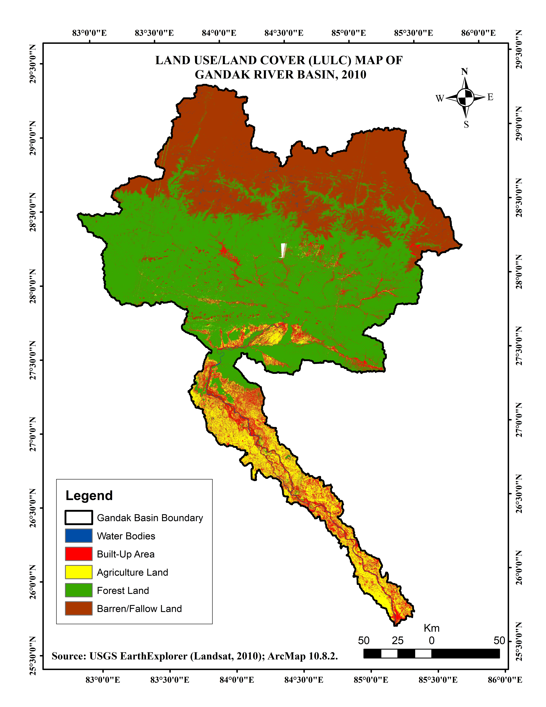

# Land Use/Land Cover (LULC) Analysis

## Project Overview

This project presents a GIS and Remote Sensing based assessment of Land Use/Land Cover (LULC) changes between 2010 and 2025.

The analysis focuses on identifying changes in major land-use and land-cover classes and visualizing spatial transformation over the study period.

## Study Period

**2010–2025**

## Objectives

- Map major LULC classes for 2010 and 2025.
- Compare spatial changes in LULC classes.
- Identify areas of land-use transformation.
- Calculate changes in LULC categories.
- Prepare thematic maps for temporal comparison.

## Software and Techniques

- QGIS
- GIS
- Remote Sensing
- Image classification
- Spatial analysis
- LULC change detection

## LULC Maps

### LULC Map – 2010

### LULC Map – 2025

## LULC Transformation

### LULC Transformation Map: 2010–2025

## Key Analysis

The project examines the spatial transformation of LULC classes between 2010 and 2025. The transformation map highlights locations where land-use and land-cover categories changed during the study period.

## Data and Sources

Satellite imagery and geospatial datasets were used for LULC mapping and change analysis.

## Tools

**Software:** QGIS, GIS and Remote Sensing tools

**Data:** Satellite imagery and derived geospatial datasets
